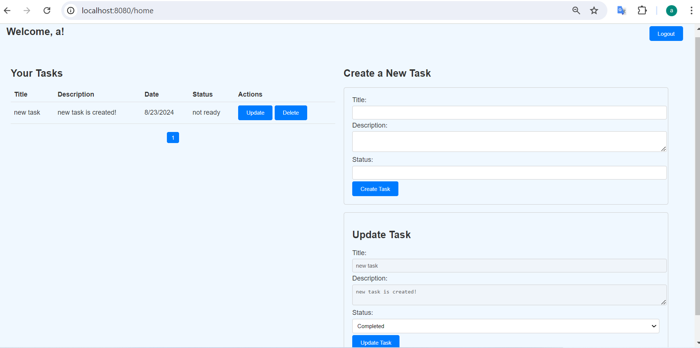

# TaskManager
A simple website for managing tasks by users.
TaskManager
A simple website for managing tasks by users.

0.Make sure you have installed Java and maven . (you can use below link to download java and install it (OpenJDK19U-jdk_x64_windows_hotspot_19.0.2_7.msi)). also make sure .mvn directory placed on root directory:
```
https://github.com/adoptium/temurin19-binaries/releases/tag/jdk-19.0.2%2B7
```

1.Run the Maven command to clean and build the project, skipping tests to speed up the process:
```
mvn clean install -DskipTests
```
2.Use Docker Compose to build the Docker images defined in your docker-compose.yml file:
```
docker-compose bulild
```
3.Use Docker Compose to start up the application and its dependencies as specified in your docker-compose.yml file:
```
docker-compose up
```
Finally, access the user page at (I created a task , then updating):


